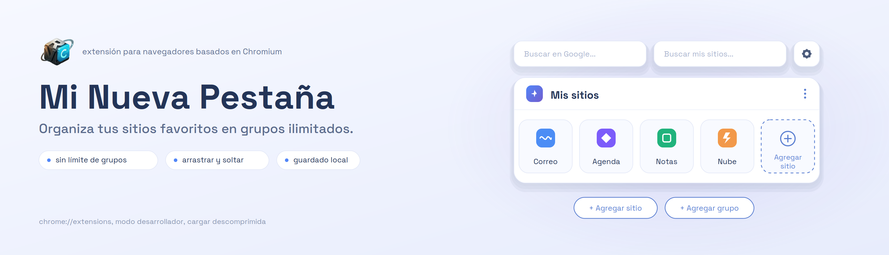
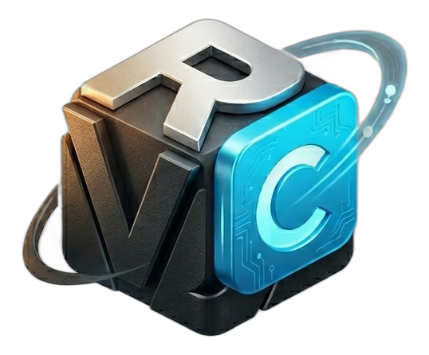

<p align="center">
  
</p>

# Mi Nueva Pestaña 


---

# 📖 Descripción

**Mi Nueva Pestaña** es una extensión para navegadores basados en **Chromium** (Manifest V3) que reemplaza la página de nueva pestaña por defecto por un panel de accesos directos totalmente personalizable, organizado por **grupos**.

Nace de una limitación concreta de las páginas de nueva pestaña nativas: solo permiten un número fijo de accesos directos y no dejan organizarlos por categorías. Esta extensión soluciona ambos problemas permitiendo crear grupos ilimitados, reordenarlos mediante **drag & drop**, personalizar la apariencia (colores, transparencias, fondos) y guardar todo de forma persistente en el navegador mediante `localStorage`.

---

# 🖼️ Vista previa


---

# ✨ Características principales

- 🗂️ **Grupos personalizados:** Crea, edita y elimina grupos para organizar tus sitios por categoría (trabajo, estudio, ocio, etc.), sin límite de cantidad.
- 🖱️ **Arrastrar y soltar (Drag & Drop):** Reordena grupos y tarjetas libremente, con auto-scroll automático al arrastrar cerca de los bordes de la pantalla.
- 🔍 **Doble buscador:** Un campo para buscar entre tus propios sitios guardados y otro para buscar directamente en la web usando el motor de búsqueda por defecto del navegador (vía `chrome.search`).
- 🎨 **Personalización visual completa:** Colores de tarjetas y grupos, transparencia, tamaño de las tarjetas, ancho del contenedor y color del texto, todo ajustable desde un panel de configuración.
- 🌄 **Fondo configurable:** Color sólido, degradado personalizado (con múltiples colores y dirección) o imagen propia como fondo de la pestaña.
- 💾 **Persistencia local:** Todos los datos (sitios, grupos y ajustes) se guardan automáticamente en `localStorage`.
- 📤 **Importar / Exportar:** Respalda o transfiere tu configuración completa entre navegadores mediante un archivo de datos.
- ⚡ **Carga sin parpadeo (FOUC):** Un script de arranque (`background-bootstrap.js`) aplica el fondo guardado antes de pintar la página.
- ♻️ **Restablecer configuración:** Botón para volver a los valores por defecto con confirmación previa.

---

# 📂 Estructura del proyecto

```
NuevaPestaña/
│
├── Icons/
│   └── icon1.png              # Ícono de la extensión
│
├── background.js               # Service worker: gestiona la búsqueda web (chrome.search)
├── background-bootstrap.js     # Precarga el fondo guardado antes de renderizar (evita parpadeo)
├── manifest.json                # Configuración de la extensión (Manifest V3, permisos, overrides)
├── newtab.html                   # Estructura de la página de nueva pestaña y los modales
├── newtab.js                      # Lógica completa: datos, grupos, tarjetas, drag & drop, ajustes
├── styles.css                      # Estilos, temas y variables visuales
├── Inicio.txt                       # Notas internas del proyecto
└── README.md
```

---

# 💻 Tecnologías utilizadas

## Frontend
- HTML5 (estructura semántica y modales)
- CSS3 (Custom Properties, Grid, Flexbox, transiciones)
- Vanilla JavaScript (ES6+)
- Web APIs: Drag and Drop, `localStorage`, `FileReader` (importar/exportar)

## Chrome Extension APIs
- `chrome.storage` (declarado en permisos)
- `chrome.search` (búsqueda web desde el service worker)
- `chrome.runtime` (mensajería entre `newtab.js` y `background.js`)

## Arquitectura
- Extensión 100% del lado del cliente: no requiere backend, base de datos ni proceso de build. Toda la lógica vive en `newtab.js` y se ejecuta directamente en el navegador al abrir una nueva pestaña.

---

# ⚙️ Funcionalidades del sistema

- ✔ Carga y renderizado dinámico de grupos y tarjetas a partir de los datos guardados en `localStorage`.
- ✔ Creación, edición y eliminación de **sitios** (nombre, URL, descripción, grupo, color de texto) con validación de campos.
- ✔ Creación, edición y eliminación de **grupos** (nombre, color) con validación de nombre duplicado/vacío.
- ✔ Sistema de **drag & drop** independiente para grupos y para tarjetas, incluyendo detección del elemento bajo el mouse y auto-scroll continuo.
- ✔ Búsqueda local que filtra las tarjetas visibles según el texto ingresado.
- ✔ Búsqueda web que envía un mensaje al `service worker` (`background.js`), el cual dispara `chrome.search.query`.
- ✔ Panel de configuración con ajustes de: tamaño del contenedor, tamaño de tarjetas, apariencia de grupos y tarjetas, color de texto, tipo de fondo (sólido / degradado / imagen).
- ✔ Exportación e importación de datos en un archivo, para respaldo o migración.
- ✔ Reinicio de configuración con modal de confirmación.

---

# ⚙️ Requisitos

- Navegador basado en **Chromium** compatible con **Manifest V3** (Google Chrome, Microsoft Edge, Brave, Opera, etc.).
- No requiere conexión a internet para funcionar (solo para los sitios web a los que accedas desde los accesos directos).

> No se requiere servidor, base de datos ni gestor de dependencias: el proyecto no usa frameworks ni npm.

---

# 🚀 Instalación

## 1. Clonar el repositorio
```bash
git clone https://github.com/rodrigo-cantor-vasquez/Extension-web-Nueva-pesta-a-.git
```

## 2. Cargar la extensión en el navegador
1. Abre `chrome://extensions` (o `edge://extensions` si usas Edge).
2. Activa el **Modo desarrollador** (esquina superior derecha).
3. Haz clic en **"Cargar descomprimida"**.
4. Selecciona la carpeta del proyecto (`NuevaPestaña/`).
5. Abre una nueva pestaña: ¡la extensión reemplazará la página por defecto!

---

# 🧠 Arquitectura del proyecto

```
Navegador ──> abre nueva pestaña ──> newtab.html
                                          │
                        ┌─────────────────┴─────────────────┐
                        ▼                                   ▼
        background-bootstrap.js                       newtab.js
   (aplica fondo guardado, sin parpadeo)     (carga datos desde localStorage)
                                                          │
                                                          ▼
                                          Renderiza grupos y tarjetas en <main>
                                                          │
                        ┌─────────────────────────────────┼─────────────────────────────────┐
                        ▼                                 ▼                                 ▼
              Drag & drop (reordenar)          Buscador local (filtra)         Buscador web (mensaje)
                        │                                                                    │
                        ▼                                                                    ▼
              Guarda cambios en localStorage                                background.js ──> chrome.search.query
```

---
<!-- 
# 🌐 Publicación en la Chrome Web Store (opcional)

Para compartir la extensión como un paquete instalable por cualquier usuario:
1. Comprime la carpeta del proyecto en un `.zip` (sin incluir la carpeta `.git`).
2. Crea una cuenta de desarrollador en el [Chrome Web Store Developer Dashboard](https://chrome.google.com/webstore/devconsole).
3. Sube el `.zip`, completa la ficha (descripción, capturas, íconos) y envíala a revisión.
4. Una vez aprobada, obtendrás un enlace público de instalación.
-->

---

# 🎯 Objetivos del proyecto

- Practicar la manipulación dinámica del DOM para construir una interfaz completa basada en datos guardados por el usuario.
- Implementar un sistema de **drag & drop** nativo (sin librerías) para grupos y tarjetas.
- Reforzar el uso de `localStorage` como mecanismo de persistencia.
- Explorar las APIs de extensiones de Chrome (`chrome.search`, `chrome.runtime`, Manifest V3) y la comunicación entre `service worker` y páginas.
- Diseñar un panel de configuración flexible con personalización visual en tiempo real mediante variables CSS.

---

# 🧠 Conocimientos aplicados

Durante el desarrollo de este proyecto se consolidaron competencias en:
- Desarrollo de extensiones de navegador con **Manifest V3** (permisos, service workers, `chrome_url_overrides`).
- Manipulación avanzada del DOM y manejo de eventos (`dragstart`, `dragover`, `drop`, `mousemove`).
- Persistencia de datos en el cliente con `localStorage` y serialización/deserialización JSON.
- Comunicación entre scripts mediante `chrome.runtime.onMessage` / `sendMessage`.
- Uso de **CSS Custom Properties** para theming dinámico (colores, transparencias, degradados).
- Validación de formularios y manejo de estados de UI (modales, menús contextuales).

---
<!-- 
# 🚀 Mejoras futuras

- Migrar de `localStorage` a `chrome.storage.sync` para sincronizar los datos entre distintos dispositivos.
- Agregar íconos automáticos (favicons) por sitio en lugar de íconos genéricos.
- Añadir soporte para importar marcadores existentes del navegador.
- Incorporar atajos de teclado para acciones frecuentes (agregar sitio, abrir buscador).
- Agregar temas predefinidos (claro/oscuro/personalizado) además del fondo configurable actual.
- Publicar oficialmente la extensión en la Chrome Web Store.

---
-->
# 👨‍💻 Autor

**RODRIGO CANTOR VASQUEZ**
GitHub: https://github.com/rodrigo-cantor-vasquez/

---

# ⭐ Si este proyecto te resulta útil...

No olvides regalarle una ⭐ al repositorio en GitHub.